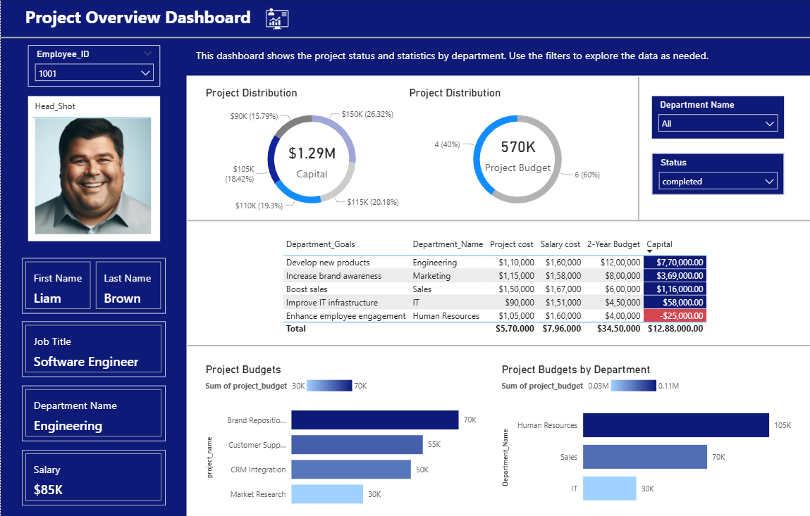

# HR & Project Analytics Dashboard (SQL & Power BI)

This project is an end-to-end HR and project performance analytics solution using SQL for data processing and Power BI for visualization. The goal is to identify underperforming departments, detect budget overflows, and improve workforce visibility.

---

## 📌 Project Overview

As per the project brief, the objective was to:
- Organize HR and project-related datasets
- Identify departments or projects that are over budget or underperforming
- Build a Power BI dashboard to visualize critical insights

🔗 [View Project Request PDF](Project_Request.pdf)

---

## 🧰 Tools Used

- **SQL (T-SQL)** – Data cleaning, joins, CTEs
- **Microsoft Power BI** – Dashboard design, filtering, KPIs
- **Excel/CSV** – Input data files

---

## 🗂️ Data Sources

The analysis integrates multiple datasets:

| File Name                  | Description                                |
|---------------------------|--------------------------------------------|
| `employees.csv`           | Employee details incl. salary and job role |
| `departments.csv`         | Department names and budgets               |
| `projects.csv`            | List of project IDs and budgets            |
| `project_assignments.csv` | Mapping of employees to projects           |
| `completed_projects.csv`  | Past projects with budgets                 |
| `upcoming projects.csv`   | Future projects with budgets               |
| `Head_Shots.csv`          | (Optional) Employee image references       |

---

## 🧠 Key Insights Generated

- 🔴 Identified departments/projects in the red (over budget or underperforming)
- 📈 Salary distribution and department budget comparisons
- 🧑‍💼 Employee allocations to completed vs upcoming projects
- 💼 Organizational view of job roles vs project types

---

## 💾 SQL Data Model

The project uses a Common Table Expression (CTE) to combine upcoming and completed projects into a unified status view.

```sql
--PROJECT STATUS
WITH project_status AS (
  SELECT project_id, project_name, project_budget, 'upcoming' AS status FROM upcoming_projects
  UNION ALL
  SELECT project_id, project_name, project_budget, 'completed' AS status FROM completed_projects
)
```

➡️ [Full SQL script here](SQLQuery1.sql)

---

## 📊 Dashboard Preview



---

## 📁 Repository Structure

```
HR-Project-Analytics-Dashboard/
│
├── data/
│   ├── employees.csv
│   ├── departments.csv
│   └── ... (other CSVs)
│
├── sql/
│   └── SQLQuery1.sql
│
├── powerbi/
│   └── HR_Project_Dashboard.pbix
│
├── docs/
│   └── project_request.pdf
│
├── images/
│   └── dashboard_preview.png
│
└── README.md
```

---

## 🚀 How to Use

1. Clone or download this repository
2. Open the `.pbix` file in Power BI Desktop
3. Review and modify SQL logic or connect your own dataset
4. Explore the dashboard interactively
